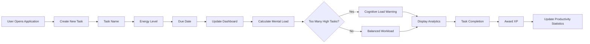

<div align="center">


<br/>


<br/>

> **To Do List ** is a next-generation productivity application built using Python and Tkinter. Unlike traditional task managers, it combines task organization, mental energy routing, productivity analytics, and gamification to help users stay productive while avoiding cognitive overload.

<br/>

[✨ Features](#-features) • [🧠 Innovation](#-the-innovation) • [🏗️ Architecture](#️-architecture) • [🛠️ Tech Stack](#️-tech-stack) • [👨‍💻 Author](#-author)

</div>

---

# ✨ Features

<table>
<tr>
<td width="50%">

### 📋 Smart Task Management

- Add Tasks
- Delete Tasks
- Complete Tasks
- Due Date Tracking
- Task Status Tracking

</td>

<td width="50%">

### 🧠 Mental Energy Routing

- 🟢 Low Energy Tasks
- 🟡 Medium Energy Tasks
- 🔴 High Energy Tasks
- Energy Load Analysis
- Cognitive Load Detection
- Smart Productivity Insights

</td>
</tr>

<tr>
<td width="50%">

### 🎮 Gamification Engine

- XP Reward System
- Productivity Score
- Achievement Tracking
- Motivation System
- Task Completion Rewards

</td>

<td width="50%">

### 📊 Analytics Dashboard

- Total Tasks
- Completed Tasks
- Pending Tasks
- XP Earned
- Mental Energy Load
- Productivity Statistics

</td>
</tr>
</table>

---

# 🧠 The Innovation


Most To-Do applications only store tasks.

**To Do List Pro** analyzes the mental effort required for each task and helps users maintain a balanced workload.

| Feature | Traditional To-Do App | To Do List Pro |
|----------|----------|----------|
| Task Management | ✅ | ✅ |
| Due Dates | ✅ | ✅ |
| Energy Tracking | ❌ | ✅ |
| Cognitive Load Analysis | ❌ | ✅ |
| Productivity Analytics | ❌ | ✅ |
| XP Rewards | ❌ | ✅ |
| Gamification | ❌ | ✅ |

### How It Works

1. User creates a task
2. Assigns an Energy Level
3. System calculates total workload
4. Cognitive Load Engine analyzes pending tasks
5. Dashboard updates automatically
6. XP is awarded when tasks are completed

---

# 🎮 Gamification System

Completing tasks earns XP points.

| Task Type | XP Reward |
|------------|------------|
| 🟢 Low Energy | +5 XP |
| 🟡 Medium Energy | +10 XP |
| 🔴 High Energy | +20 XP |

Example:

```text
Completed Task: Python Project

Reward Earned: +20 XP
```

---

# ⚠️ Cognitive Load Detection

When too many high-energy tasks are assigned:

```text
⚠️ Cognitive Load Critical!

Too many deep-work tasks pending.

Consider balancing your workload.
```

This feature helps users avoid burnout and improve planning.

---

# 🔄 Workflow



---

# 🏗️ Architecture

```text
ToDo-List-Pro/
│
├── main.py
│   │
│   ├── GUI Interface
│   ├── Task Management Engine
│   ├── Energy Routing Engine
│   ├── XP System
│   ├── Analytics Dashboard
│
├── tasks.json
│
└── README.md
```

---

# 📊 Dashboard Overview

The dashboard displays:

- Total Tasks
- Completed Tasks
- Pending Tasks
- Mental Energy Load
- XP Earned
- Productivity Progress

Example:

```text
Total Tasks: 15

Completed: 10

Pending: 5

XP Earned: 120

Mental Energy Load: Moderate
```

---

# 🛠️ Tech Stack

<div align="center">

| Layer | Technology | Purpose |
|---------|------------|------------|
| Frontend | Tkinter | Graphical User Interface |
| Backend Logic | Python | Application Logic |
| Storage | JSON | Task Storage |
| Analytics | Python | Productivity Statistics |
| Gamification | Custom Logic | XP & Rewards |

</div>

---

# 🎯 Future Enhancements

- 🔥 Daily Streak System
- 📅 Calendar Integration
- 🌙 Dark Mode
- ⏳ Pomodoro Timer
- 📈 Weekly Reports
- ☁️ Cloud Synchronization
- 🤖 AI Task Suggestions


# 👨‍💻 Author

<div align="center">

### Joe Flaming

**CodSoft Python Programming Internship**

[](https://github.com/joeflaming777-lgtm)

</div>

---

<div align="center">

### ⭐ CodSoft Internship Project


</div>
