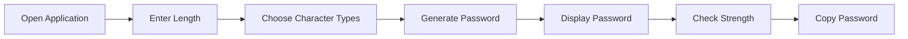

<div align="center">


<br/>


<br/>

> **Password Generator** is a modern desktop application built using Python and Tkinter that helps users generate strong and secure passwords instantly. It offers customizable password options, strength indication, clipboard support, and a clean graphical user interface.

<br/>

[✨ Features](#-features) • [🚀 Innovation](#-innovation) • [🏗️ Architecture](#️-architecture) • [🛠️ Tech-Stack](#️-tech-stack) • [👨‍💻 Author](#-author)

</div>

---

# ✨ Features

<table>
<tr>
<td width="50%">

### 🔐 Password Generation

* Generate Secure Passwords
* Custom Password Length
* Random Character Selection
* Instant Generation
* Strong Encryption Logic

</td>

<td width="50%">

### ⚡ Security Features

* Uppercase Letters
* Lowercase Letters
* Numbers
* Special Characters
* Strong Password Support

</td>
</tr>

<tr>
<td width="50%">

### 🎨 User Interface

* Modern Dark Theme
* Clean Layout
* Responsive Design
* Easy Navigation
* User-Friendly Controls

</td>

<td width="50%">

### 📋 Utility Features

* Copy Password Button
* Password Strength Indicator
* Input Validation
* Error Handling
* Fast Processing

</td>
</tr>
</table>

---

# 🚀 Innovation

## Modern Secure Password Generation

Traditional password generators often provide limited customization and poor user experience.

**Password Generator** offers a professional desktop interface with advanced password customization options, password strength checking, and clipboard support.

| Feature             | Traditional Generator | Password Generator |
| ------------------- | --------------------- | ------------------ |
| Random Passwords    | ✅                     | ✅                  |
| GUI Interface       | ❌                     | ✅                  |
| Custom Length       | ❌                     | ✅                  |
| Strength Indicator  | ❌                     | ✅                  |
| Copy to Clipboard   | ❌                     | ✅                  |
| Error Handling      | ❌                     | ✅                  |
| Character Selection | ❌                     | ✅                  |

---

# ⚙️ How It Works

1. User enters desired password length
2. Selects character categories
3. Application generates a random password
4. Password is displayed instantly
5. Strength is analyzed
6. User can copy the password to clipboard

---

# 📊 Password Options

| Option    | Description  |
| --------- | ------------ |
| Uppercase | A-Z          |
| Lowercase | a-z          |
| Numbers   | 0-9          |
| Symbols   | !@#$%^&*     |
| Length    | User Defined |

---

# 🔄 Workflow



---

# 🏗️ Architecture

```text
Password-Generator/
│
├── password_generator.py
│
├── assets/
│
├── screenshots/
│
└── README.md
```

---

# 📱 User Interface

The application includes:

* Modern Dark Theme
* Password Length Input
* Character Selection Checkboxes
* Generate Button
* Password Display Field
* Password Strength Indicator
* Copy Password Feature

---

# 🛠️ Tech Stack

<div align="center">

| Layer         | Technology    | Purpose              |
| ------------- | ------------- | -------------------- |
| Frontend      | Tkinter       | GUI Development      |
| Backend Logic | Python        | Application Logic    |
| Security      | Random Module | Password Generation  |
| Utilities     | String Module | Character Management |

</div>

---

# 🎯 Future Enhancements

* 🔒 Password Save Feature
* ☁️ Cloud Password Sync
* 🌙 Multiple Themes
* 📊 Password Analytics
* 🔑 Password Manager Integration
* 🎤 Voice Commands
* 🔐 Advanced Encryption Support

---


---

# 👨‍💻 Author

<div align="center">

### Joe Flaming

**CodSoft Python Programming Internship**

[](https://github.com/joeflaming777-lgtm)

</div>

---

<div align="center">

### ⭐ CodSoft Internship Project


</div>
